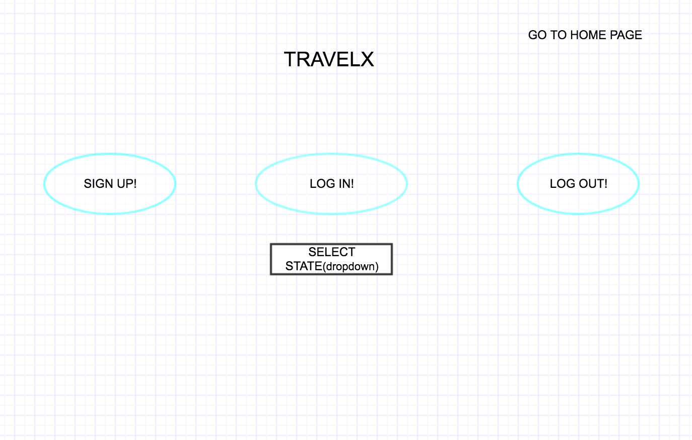

# project2-travelx

## OVERVIEW

The basic concept of this app is to provide the user, useful information about the cities in the US.

## PROJECT DETAILS

### Necessary features
1. Provide the user the following basic information about a city.
2. It will include details such as Restaurants and Tourist Attractions.
3. The user will be able to add in the above key information about new cities.
4. The user can also edit information about existing cities.
5. The user has to register first to do the CRUD operations.

### Advanced Features
1. All changes made by the user should will be qued for admin's review.
2. Only the users who sign up can add and edit information about the cities.
3. The cities will include the list of hotels and car rentals as well.

### WireFrames

### User Stories
1. The user chooses any one of the states listed and the cities.
2. Then the user will be navigated to the list if restaurants and tourist attraction places where the user can implement CRUD operations.

### Links & Resources
1. stackoverflow
2. W3 schools.
3. developer.mozilla.org
4. passportjs.org

